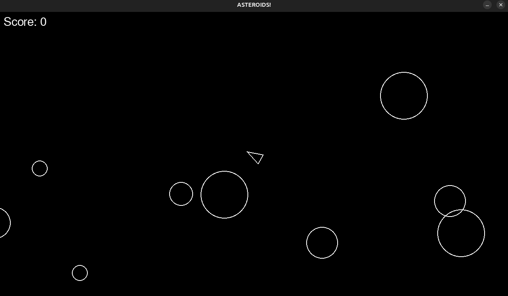

# Asteroids

This project is still in development.
  
<u>To Fix: <u/>
  
~~Cant close from main.py after re-opening with subprocess~~
   
  ^^ fixed by changing <i>subprocess.run(["python", "main.py"])<i/> to <i>os.execv(sys.executable, main())<i/>
   
Stays running in CLI after closing from game_over.py

